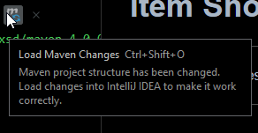

# Item Shop Devlog/Changelog

---
All noteable changes to this project will be documented in this file.  

---
## To Do
- Finish Order JDBC Class
- Finsih Order table mock data
- Supply enum parameters for Inventory and Customer Menu
- Model Classes: Cart, Inventory, Customer, Purchase
- Dao Classes: All need work
- Database Tables need creation and population

---
## 3/27/2023
### Added
- View package with a `MainMenu` enum
	+ going to try using Enums to navigate through this CLI experience
- `CustomerMenu` Enum
- `InventoryMenu` Enum

### Notes
In the Main `ItemShop` class it's set up to iterate through some enums to test that out. The `MainMenu` enum is initialized with String parameters to supply a description. The other enums have not had this added yet.

---
## 3/25/2023 (cont.)

### Added
- Changed data type of all "Id" fields to long from int
- Database Change: Added orders table, populating table with mock data WIP
- Database Change: Inventory added to item table

### Notes
Need to research how to interpret multiples of one item, and translate an array into data. Also need to have total value calculated based on the cart when inserting the value. There is a way to do this with SQL.
For the purpose of completing this exercise hard numbering a value with do fine. We simply need the total of the value of any orders.

---
## 3/25/2023

### Project Setup
#### Initial Bones
- Maven Project
- JDK 17
- ItemShop Database created and .sql files written  
- Item and Order Model classes created
- Item and Order DAO Interfaces created

Before any information can be transferred between the program and the database we need to establish a connection. To do this we do about 5 things:  
- Add the apache `commons-dbcp2` dependency to our pom.xml  
- Reload the Maven project with this dependency added  
- Import the dbcp2 `BasicDataSource` class to the project  
- Write a connection string  
- Connect the Program to the Database using BasicDataSource  

#### Add the apache commons dbcp2 dependency
Within the `<dependencies>` section of the pom.xml we need to add this dependency  
```
    <dependencies>
        <dependency>
            <groupId>org.apache.commons</groupId>
            <artifactId>commons-dbcp2</artifactId>
            <version>2.9.0</version>
        </dependency>
    </dependencies>
```
#### Reload the Maven Project
With the dependency added, the project can be reloaded with the `Ctrl+Shift+O` keys. Alternatively, an icon may pop up in the corner of your pom.xml screen. Clicking this will do the same thing.  
  
#### Import the BasicDataSource Class
Within the top of the Main (ItemShop) class we will import the following dependencies  
```
import org.apache.commons.dbcp2.BasicDataSource;
import javax.sql.DataSource;
```

#### Write a connection string
Connection String follows this format  
`jdbc:postgresql://SERVER_NAME:PORT/DATABASE_NAME`  
- `jdbc`: the protocol is JDBC
- `postgresql`: the driver name. (We're using PostgreSQL)
- `SERVER_NAME`: the host name or IP address of the database server
- `PORT`: The port number of the database server
- `DATABASE_NAME`: the name of the database on the server  

Our connection string looks like this  
`jdbc:postgresql://localhost:5432/ItemShop`  
#### Connect the Program to the Database using BasicDataSource
First need is to instantiate the `BasicDataSource`  
`BasicDataSource dataSource = new BasicDataSource();`  
Then set the connection string as the URL, we also need to include credentials. For the time being they will be coded in.  
```
dataSource.setUrl("jdbc:postgresql://localhost:5432/ItemShop");
dataSource.setUsername("postgres");
dataSource.setPassword("postgres1");
```
  
We now have a program which can connect to a Database. We also need Data object classes. This is where `JdbcTemplate` comes in. We will create Jdbc Object classes, and use this template there.  

---
### JDBC and DAO classes
#### DAO Classes
- DAO Interfaces have generic methods like a regular interface, some may contain parameters
- These methods will be implemented and written out within the JDBC Object classes
- To start this project off the Item and the Order DAO have been written to do the following:  
	+ Return an item object from the database
	+ Return items matching a specific type
	+ Return an order object from the database 
	+ Return the total gold value of all orders, pending and delivered

#### JDBC Driver
In order to be able to import the necessary JdbcTemplate class we will need to add the following dependencies to our pom.xml
```
<dependency>
    <groupId>org.postgresql</groupId>
    <artifactId>postgresql</artifactId>
	<version>42.2.12</version>
</dependency>
<dependency>
    <groupId>org.springframework</groupId>
    <artifactId>spring-jdbc</artifactId>
    <version>6.0.6</version>
</dependency>
```

This adds the PostgreSQL driver and JDBC driver from the Spring Framework. Now JDBC Object classes can be created from Data we retrieve from our PostgreSQL database. We will use this data in the implentation of the DAO methods.

#### JdbcItemDao
This class will contain the logic for handling database queries and mapping them to model objects for use within the program. In order for returned queries to be represented in the program they need to be mapped to an object via a mapper method.  
```
private Item mapRowToItem(SqlRowSet rs) { // rs for rowSet
        Item item = new Item();
        item.setItemId(rs.getLong("item_id"));
        item.setItemName(rs.getString("item_name"));
        item.setItemType(rs.getString("item_type"));
        item.setItemValue(rs.getInt("item_value"));
        item.setItemDescription(rs.getString("item_desc"));
        if (rs.wasNull()) {
            item.setItemId(null);
        }
        return item;
    }
```

#### Implement/Override DAO methods
Add logic to return a list of items based on the type selected by the user
- Create an empty List object to compile results to
- Set a SQL string which retrieves the necessary data to a variable
- Create a `SqlRowSet` object which takes the `jdbcTemplate`'s `queryForRowSet()` method and access the database
	+ this query method takes the sql statement, and the calling method's parameter. In this case it is the `itemType`
- Iterate through the results. Using a while loop based on if our resulting set of Rows has a "next" row. Add each row to the List
- return the List to the user  
```
@Override
    public List<Item> findItemsByType(String itemType) {
        List<Item> items = new ArrayList<>();
        String sql = "SELECT item_id, item_name, item_type, item_value, item_desc " +
                     "FROM item " +
                     "WHERE item_type LIKE ?;";
        itemType = "%" + itemType + "%";
        SqlRowSet results = jdbcTemplate.queryForRowSet(sql, itemType);
        while (results.next()) {
            items.add(mapRowToItem(results));
        }
        return items;
    }
```

We have a mapping method for returning items, and we have a method which will return items by relevant types. This method is tested in the main class for now. Database connectivity is established.  
  